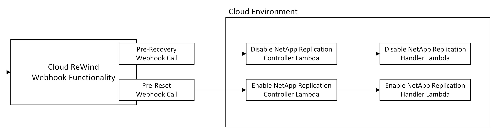

# NetApp Replication Lambda

## Workflow

### Resposibities and Purposes

| Scripts               | Responsibility     | Purpose                                                                                         |
|-----------------------|--------------------|-------------------------------------------------------------------------------------------------|
| ControllerScripts     |  Cloud ReWind      | Iterates over the NetApp System Manager IPs and passes it to the `ReplicationHandler` function  |
| ReplicationHandler    |  Customers/Users   | Enables/Disables the NetApp Replication using the System Manager IP                             |

### Overview

- Cloud ReWind Webhook Functionality will trigger 'Pre-Recovery' Webhook call to the `DisableNetAppReplicationControllerLambda` Script to disable the NetApp Replication at the time of recovering the source region resources.
- During the reset of the recovered resources, Cloud ReWind Webhook Functionality will trigger 'Pre-Reset' Webhook call to the `EnableNetAppReplicationControllerLambda` Script to enable the Replication among the NetApp Servers.

**Reference**: [Documentation to configure a Webhook in Cloud ReWind Console](https://documentation.commvault.com/cloud_rewind/webhooks.html)

### DisableNetAppReplicationControllerLambda (Pre-Recovery Webhook Lambda)
- Create a lambda function with `Python 3.11` runtime by deploying the ZIP archives, with a timeout of 5 mins, that triggers the `DisableNetAppReplication` script for each system manager IPs.
- This function will validate the webhook token (ax_token) and passes each system manager IPs to the `DisableNetAppReplication` lambda endpoint for disabling the replication of NetApp servers.
- Following are the environment variables for the lambda function

		disable_url → Endpoint URL of the `DisableNetappReplicationLambda`
		ax_token    → Any Random Token to validate the Webhook call to invoke the Lambda function (Exm: I_am_Spartacus)
		sys_mgr_ips → List of NetApp System Manager IPs (Exm: 192.168.0.10, 192.168.0.11)

	Example Pre-Recovery Webhook Endpoint: https://example.com/path?ax_token=I_am_Spartacus

### EnableNetAppReplicationControllerLambda (Pre-Reset Webhook Lambda)
- Create a lambda function with `Python 3.11` runtime by deploying the ZIP archives, with a timeout of 5 mins, that triggers the `EnableNetAppReplication` script for each system manager IPs.
- This function will validate the webhook token (ax_token) and passes each system manager IPs to the `EnableNetAppReplication` lambda endpoint for enabling the replication of NetApp servers.
- Following are the environment variables for the lambda function

		enable_url  → Endpoint URL of the `EnableNetappReplicationLambda`
		ax_token    → Random Token to validate the Webhook call to invoke the Lambda function (Exm: I_am_Spartacus)
		sys_mgr_ips → List of NetApp System Manager IPs (Exm: 192.168.0.10, 192.168.0.11)

**Reference**: [Zip archives for AWS Lambda](https://docs.aws.amazon.com/lambda/latest/dg/python-package.html#python-package-create-dependencies)

**Note**: 
- Make sure the security groups are allowed to access the lambda and the FSx cluster.
- Make sure this lambda function is accessible to all the system manager IP’s.
- If the FSx cluster is in another VPC then peer the VPCs and configure the lambda connection to the Peered VPC for the lambda to access the resources.

### EnableNetAppReplication and DisableNetAppReplication Lambda Functions (Invoked by the `NetAppReplicationControllerLambda` Functions)

- Both the `EnableNetAppReplication` and `DisableNetAppReplication` lambda functions scripts are customized and owned by the Customers based on their needs. 
- Following are the environment variables for the lambda functions

	
	basic_token → [Encoded token value of FSX cluster-admin username and password to authenticate](https://mixedanalytics.com/tools/basic-authentication-generator/)